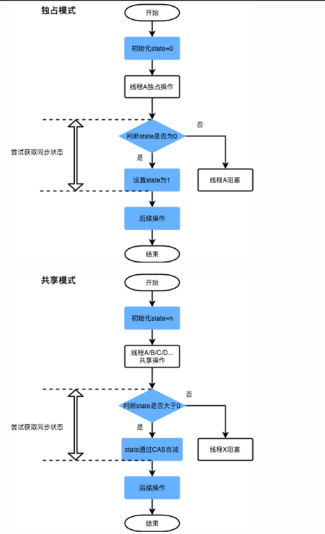

## ReentrantLock简介（ *what-是什么* ）
> author：阿沐  
> 备注：教练总结
---
ReentrantLock，重入锁，就是支持冲入的锁，支持一个线程对资源的重复加锁，该锁还支持公平和非公平的选择。

### 理解ReentrantLock
- ReentrantLock不同于Synchronized的隐式重入，基于AQS实现，调用lock()获取锁，再次调用lock()不会被阻塞。   
- ReentrantLock提供了一个构造函数，控制锁是否是公平的。非公平锁效率更高，但非公平锁能减少“饥饿”的发生概率。
```
//默认非公平锁
public ReentrantLock() {
    sync = new NonfairSync();
}
//公平锁
public ReentrantLock(boolean fair) {
    sync = fair ? new FairSync() : new NonfairSync();
}
```

###  ReentrantLock与AQS的关联
AQS是Java并发包里实现锁、同步的一个重要的基础框架。


## ReentrantLock使用（ *how-怎么用* ）
---
### 例子1：普通锁用法
```
1.初始化，默认构造函数为非公平锁
private ReentrantLock lock = new ReentrantLock();
public void run() {
    lock.lock();
    try {
        //do something
    } catch (InterruptedException e) {
        e.printStackTrace();
    } finally {
        //手动释放锁
        lock.unlock();
    }
}
```
## ReentrantLock剖析 （ *how-什么原理* ）
---
### 核心的几个方法
```
lock()   //加锁
unlock() //释放锁
tryLock()  //
tryLock()
ReentrantLock()  //默认非公平锁
ReentrantLock(boolean)  //指定锁类型
```
### 加锁 lock方法实现
```
public void lock() {
        sync.lock();
}
//使用 sync的方法，而这个方法是一个抽象方法，具体是由其子类(FairSync)来实现的
```
#### 非公平锁实现
```
 static final class NonfairSync extends Sync {

        //直接获取锁，抢占模式
        final void lock() {
            if (compareAndSetState(0, 1))
                //当前线程置为获得锁的独占线程
                setExclusiveOwnerThread(Thread.currentThread());
            else
                acquire(1);
        }

        protected final boolean tryAcquire(int acquires) {
            return nonfairTryAcquire(acquires);
        }
    }

  final boolean nonfairTryAcquire(int acquires) {
            final Thread current = Thread.currentThread();
            int c = getState();
            //不同之处：非公平锁不需要判断队列中是否还有其他线程，直接尝试获取锁，即没有调hasQueuedPredecessors
            if (c == 0) {
                if (compareAndSetState(0, acquires)) {
                    setExclusiveOwnerThread(current);
                    return true;
                }
            }
            else if (current == getExclusiveOwnerThread()) {
                int nextc = c + acquires;
                if (nextc < 0) // overflow
                    throw new Error("Maximum lock count exceeded");
                setState(nextc);
                return true;
            }
            return false;
        }
```

> 某个线程获取锁失败的后续流程是什么呢？有以下两种可能：
1. 将当前线程获锁结果设置为失败，获取锁流程结束。这种设计会极大降低系统的并发度，并不满足我们实际的需求。
2. AQS框架的处理流程，存在某种排队等候机制，线程继续等待，仍然保留获取锁的可能，获取锁流程仍在继续。
>带着这个问题看下公平锁的实现
#### 公平锁实现
 ```
 static final class FairSync extends Sync {

        final void lock() {
            acquire(1);
        }

        protected final boolean tryAcquire(int acquires) {
            final Thread current = Thread.currentThread();
            int c = getState();
            //判断AQS的state是否等于0，0表示目前没有其他线程获得锁
            if (c == 0) {
                //hasQueuedPredecessors判断AQS的队列中是否有其他线程
                //CAS将AQS的state修改为1，即获取锁
                if (!hasQueuedPredecessors() &&
                    compareAndSetState(0, acquires)) {
                    //当前线程置为获得锁的独占线程
                    setExclusiveOwnerThread(current);
                    return true;
                }
            }
            //锁重入，state + 1
            else if (current == getExclusiveOwnerThread()) {
                int nextc = c + acquires;
                if (nextc < 0)
                    throw new Error("Maximum lock count exceeded");
                setState(nextc);
                return true;
            }
            return false;
        }
    }
```
##### 线程加入等待队列
> 当执行Acquire(1)时，会通过tryAcquire获取锁。在这种情况下，如果获取锁失败，就会调用addWaiter加入到等待队列中去。
```
private Node addWaiter(Node mode) {
	Node node = new Node(Thread.currentThread(), mode);
	// Try the fast path of enq; backup to full enq on failure
	Node pred = tail;
	if (pred != null) {
		node.prev = pred;
		if (compareAndSetTail(pred, node)) {
			pred.next = node;
			return node;
		}
	}
	enq(node);
	return node;
}
private final boolean compareAndSetTail(Node expect, Node update) {
	return unsafe.compareAndSwapObject(this, tailOffset, expect, update);
}
//首先判断队列是否为空，不为空时则将封装好的 Node 利用 CAS 写入队尾，如果出现并发写入失败就需要调用 enq(node)来写入
private Node enq(final Node node) {
	for (;;) {
		Node t = tail;
		if (t == null) { // Must initialize
			if (compareAndSetHead(new Node()))
				tail = head;
		} else {
			node.prev = t;
			if (compareAndSetTail(t, node)) {
				t.next = node;
				return t;
			}
		}
	}
}
```
### 释放锁 unlock方法实现
```
public void unlock() {
    sync.release(1);
}
public final boolean release(int arg) {
    if (tryRelease(arg)) {
        Node h = head;
        if (h != null && h.waitStatus != 0)
        	   //唤醒被挂起的线程
            unparkSuccessor(h);
        return true;
    }
    return false;
}
//尝试释放锁  将state减到0才认为完全释放锁
protected final boolean tryRelease(int releases) {
    int c = getState() - releases;
    if (Thread.currentThread() != getExclusiveOwnerThread())
        throw new IllegalMonitorStateException();
    boolean free = false;
    if (c == 0) {
        free = true;
        setExclusiveOwnerThread(null);
    }
    setState(c);
    return free;
}
```
## AQS框架
  
### AQS原理
AQS核心思想是，如果被请求的共享资源空闲，那么就将当前请求资源的线程设置为有效的工作线程，将共享资源设置为锁定状态；如果共享资源被占用，就需要一定的阻塞等待唤醒机制来保证锁分配。这个机制主要用的是CLH队列的变体实现的，将暂时获取不到锁的线程加入到队列中。

CLH：Craig、Landin and Hagersten队列，是单向链表，AQS中的队列是CLH变体的虚拟双向队列（FIFO），AQS是通过将每条请求共享资源的线程封装成一个节点来实现锁的分配。

AQS中最基本的数据结构——Node，Node即为上面CLH变体队列中的节点。
| 锁模式 | 含义 |
| --- | --- |
| SHARED | 表示线程以共享的模式等待锁 |
| EXCLUSIVE | 表示线程正在以独占的方式等待锁 |
#### 同步状态State
AQS中维护了一个名为state的字段，意为同步状态，是由Volatile修饰的，用于展示当前临界资源的获锁情况。
```
private volatile int state;
int getState()
setState(int newState)
boolean compareAndSetState(int expect, int update)
```
  
