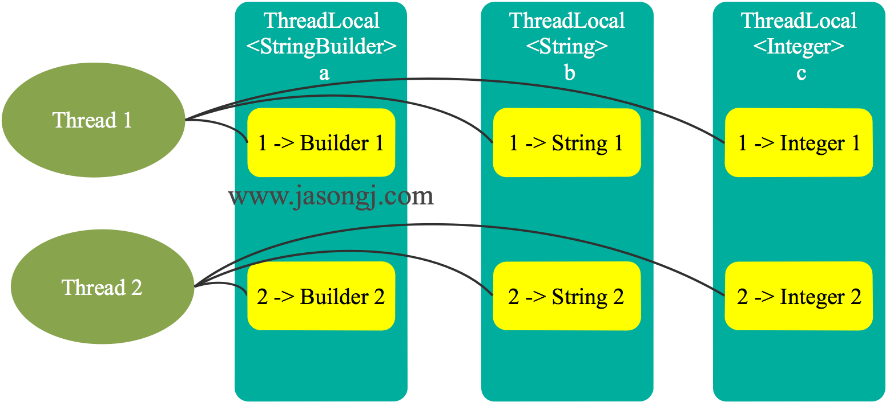

##ThreadLocal简介（ *what-是什么* ）
> author：阿沐  
> 备注：教练总结
---
ThreadLocal，很多地方叫做线程本地变量，也有些地方叫做线程本地存储。
### 正确理解Threadlocal
ThreadLocal并不解决多线程共享变量的问题。既然变量不共享，那就更谈不上同步的问题。   
> 它的基本原理是，同一个ThreadLocal所包含的对象（对ThreadLocal< String >而言即为String类型变量），在不同的Thread中有不同的副本。
  ThreadLocal适用于每个线程需要自己独立的实例且该实例需要在多个方法中被使用，也即变量在线程间隔离而在方法或类间共享的场景。     

综上所述，ThreadLocal适用于如下两种场景：  
- 每个线程需要有自己单独的实例  
- 实例需要在多个方法中共享，但不希望被多线程共享  
### 猜测Threadlocal实现原理   
#### 猜测方案一
> 我们通常想到的实现方案  
> ThreadLocal维护一个Map，键是Thread，值是它在该Thread内的实例。   
  

该方案可满足上文提到的每个线程内一个独立备份的要求。但是有两个问题：  
- 增加线程与减少线程均需要写Map，故需保证该Map线程安全；出现锁的问题，原因在于多线程访问同一个Map 。  
- 线程结束时，需要保证它所访问的所有ThreadLocal中对应的映射均删除，否则可能会引起内存泄漏。（线程结束时，需要保证它所访问的所有ThreadLocal中对应的映射均删除，否则可能会引起内存泄漏。  
#### 猜测方案二
> jdk源码的实现方案   
> 该Map由Thread维护，从而使得每个Thread只访问自己的Map，那就不存在多线程写的问题，也就不需要锁了。  
  

　　但是由于每个线程访问某ThreadLocal变量后，都会在自己的Map内维护该ThreadLocal变量与具体实例的映射，如果不删除这些引用（映射），则这些 ThreadLocal 不能被回收，可能会造成内存泄漏。   
后文会介绍 JDK 如何解决该问题。   

## Threadlocal使用场景（ *how-怎么用* ）
---
### 例子：数据库连接管理
>看下下面例子存在的问题  
```
/**
 * @Comment  数据库连接管理
 * @auther amu
 * @date 2018/8/7 17:39
 */
public class ConnectionManager {

   private static Connection connection=null;

   /**
    * 获取db连接
    * @param url
    * @param user
    * @param pass
    * @return
    */
   public static Connection getConnection(String url,String user,String pass){
      if(connection==null) {
         try {
            connection = DriverManager.getConnection(url,user,pass);
         } catch (SQLException e) {
            e.printStackTrace();
         }
      }
      return connection;
   }

   /**
    * 关闭db连接
    */
   public static void close(){
      if(connection!=null)
         try {
            connection.close();
         } catch (SQLException e) {
            e.printStackTrace();
         }
   }
}
```
单线程没有问题；多线程环境呢？  
### 问题分析
存在如下两个安全问题：
1. getConnection方法没有加锁或同步，可能会获取多个数据库连接；一般数据库连接操作都要求做成单例，放在连接池中使用。  
2. getConnection方法和close方法没有同步，connection又是共享变量，存在一个线程刚获取连接，但是被另一个线程关闭了。  
> 局部使用这个数据库连接管理工具可以解决以上多线程的问题，因为局部方法中现用现创建也就没有多线程问题了；  
  但是这样做频繁的开启连接、关闭连接，严重消耗系统性能；数据库连接操作频繁，也造成对数据库的压力。  

## 剖析ThreadLocal （ *how-什么原理* ）
---
### 核心的几个方法
```
public T get() { }   //用来获取ThreadLocal在当前线程中保存的变量副本
public void set(T value) { }   //用来设置当前线程中变量的副本
public void remove() { }   //用来移除当前线程中变量的副本
protected T initialValue() { }  //是一个protected方法，一般是用来在使用时进行重写的，它是一个延迟加载方法
```
#### get方法实现
```
public T get() {
    Thread t = Thread.currentThread();
    ThreadLocalMap map = getMap(t);
    if (map != null) {
        ThreadLocalMap.Entry e = map.getEntry(this);     //注意这里获取键值传入的是this，不是当前线程t
        if (e != null) {
            @SuppressWarnings("unchecked")
            T result = (T)e.value;
            return result;
        }
    }
    return setInitialValue();    //如果map为空，则调用setInitialValue方法返回value
}
```
getMap方法做了什么呢？   
　　返回当前线程t中的一个成员变量threadLocals；threadlocals实际就是一个threadLocalMap；threadLocalMap是ThreadLocal类中的一个内部类;做存储结构使用.   
```
ThreadLocalMap getMap(Thread t) {
    return t.threadLocals;
}
static class ThreadLocalMap {
    static class Entry extends WeakReference<ThreadLocal<?>> {
        /** The value associated with this ThreadLocal. */
        Object value;
        Entry(ThreadLocal<?> k, Object v) {
            super(k);
            value = v;
        }
    }
```
　　Entry类继承了WeakReference<ThreadLocal<?>>，即每个Entry对象都有一个ThreadLocal的弱引用（作为key），这是为了防止内存泄露。一旦线程结束，key变为一个不可达的对象，这个Entry就可以被GC了。   
　　使用弱引用的原因在于，当没有强引用指向ThreadLocal变量时，它可被回收，从而避免ThreadLocal不能被回收而造成的内存泄漏的问题。   
　　但是，这里又可能出现另外一种内存泄漏的问题。ThreadLocalMap维护ThreadLocal变量与具体实例的映射，当ThreadLocal变量被回收后，该映射的键变为 null，该Entry无法被移除。从而使得实例被该Entry引用而无法被回收造成内存泄漏。  
　　ThreadLocalMap的set方法通过调用replaceStaleEntry方法回收键为null的Entry对象的值（即为具体实例）以及Entry对象本身从而防止内存泄漏。   
  
#### setInitialValue方法实现
```
private T setInitialValue() {
    T value = initialValue();
    Thread t = Thread.currentThread();
    ThreadLocalMap map = getMap(t);
    if (map != null)
        map.set(this, value);
    else
        createMap(t, value);
    return value;
}
```
如果map不为空，就设置键值对，为空，再创建Map，看一下createMap的实现   
```
void createMap(Thread t, T firstValue) {
    t.threadLocals = new ThreadLocalMap(this, firstValue);
}
```
#### set方法实现
不再多说，跟setInitialValue实现如出一辙。区别是value是传进来的，前者是需要内部重写的一个方法返回的。   
```
public void set(T value) {
    Thread t = Thread.currentThread();
    ThreadLocalMap map = getMap(t);
    if (map != null)
        map.set(this, value);
    else
        createMap(t, value);
}
```
　　每个Thread对象内部都维护了一个ThreadLocalMap这样一个ThreadLocal的Map，可以存放若干个ThreadLocal。   
```
/* ThreadLocal values pertaining to this thread. This map is maintained
 * by the ThreadLocal class. */
ThreadLocal.ThreadLocalMap threadLocals = null;
```
至此，大部分人已经明白了ThreadLocal是如何为每个线程创建变量的副本的：  
　　首先，在每个线程Thread内部有一个ThreadLocalMap类型的成员变量threadLocals，这个threadLocals就是用来存储实际的变量副本的，键值为当前ThreadLocal变量，value为变量副本（即T类型的变量）。    
　　初始时，在Thread里面，threadLocals为空，当通过ThreadLocal变量调用get()方法或者set()方法，就会对Thread类中的threadLocals进行初始化，并且以当前ThreadLocal变量为键值，以ThreadLocal要保存的副本变量为value，存到threadLocals。然后在当前线程里面，如果要使用副本变量，就可以通过get方法在threadLocals里面查找。  
#### 总结一下
1. 实际的通过ThreadLocal创建的副本是存储在每个线程Thread自己的threadLocals中的；   
2. 为何threadLocals的类型ThreadLocalMap的键值为ThreadLocal对象，因为每个线程中可有多个threadLocal变量。将ThreadLocal和线程巧妙地绑定在了一起，即可以保证无用的ThreadLocal被及时回收，不会造成内存泄露，又可以提升性能。  
3. 在进行get之前，必须先set，否则会报空指针异常；如果想在get之前不需要调用set就能正常访问的话，必须重写initialValue()方法。  
4. 因为threadlocal底层的threadlocalmap的key存的是this（threadlocal本身），并且每个thread线程存在一个threadlocalmap变量，所以同一个thread可以放多个值；颠覆的是如果大家认为的key存的是thread，这样一个thread只能存放一个数据了。   
### 扩展说下ThreadLocalMap的实现
　　可能大部分人以为threadlocal内部使用了一个hashmap来实现存储，但实际threadlocal自己在内部实现了一个类似hashmap的threadLocalMap。   
- 先看下ThreadLocalMap的构造方法  
```
ThreadLocalMap(ThreadLocal<?> firstKey, Object firstValue) {
    table = new Entry[INITIAL_CAPACITY];
    int i = firstKey.threadLocalHashCode & (INITIAL_CAPACITY - 1);
    table[i] = new Entry(firstKey, firstValue);
    size = 1;
    setThreshold(INITIAL_CAPACITY);
}
```
　　构造函数的第一个参数就是本ThreadLocal实例(this)，第二个参数就是要保存的线程本地变量。构造函数首先创建一个长度为16的Entry数组，然后计算出firstKey对应的哈希值，然后存储到table中，并设置size和threshold。   
　　注意一个细节，计算hash的时候里面采用了hashCode & (size - 1)的算法，这相当于取模运算hashCode % size的一个更高效的实现（和HashMap中的思路相同）。正是因为这种算法，我们要求size必须是2的指数，因为这可以使得hash发生冲突的次数减小。   
- 再看下ThreadLocalMap的set方法  
```
private void set(ThreadLocal<?> key, Object value) {
    Entry[] tab = table;
    int len = tab.length;
    int i = key.threadLocalHashCode & (len-1);
    for (Entry e = tab[i];
         e != null;
         e = tab[i = nextIndex(i, len)]) {
        ThreadLocal<?> k = e.get();
        if (k == key) {
            e.value = value;
            return;
        }
        if (k == null) {
            replaceStaleEntry(key, value, i);
            return;
        }
    }
    tab[i] = new Entry(key, value);
    int sz = ++size;
    if (!cleanSomeSlots(i, sz) && sz >= threshold)
        rehash();
}
```
- 看下nextIndex方法，ThreadLocalMap是如何计算hash的   
```
private static int nextIndex(int i, int len) {
    return ((i + 1 < len) ? i + 1 : 0);
}
```
我们看到ThreadLocalMap解决冲突的方法是线性探测法（不断加1），而不是HashMap的链地址法，这一点也能从Entry的结构上推断出来。 

## 使用ThreadLocal解决案例中的多线程并发问题
---
```
/**
 * @Comment  数据库连接管理  使用threadlocal 优化版
 * @auther amu
 * @date 2018/8/7 17:39
 */
public class ConnectionManager {


   private static final ThreadLocal<Connection> THREAD_LOCAL = new ThreadLocal<>();

   /**
    * 获取db连接
    * @param url
    * @param user
    * @param pass
    * @return
    */
   public static Connection getConnection(String url,String user,String pass){
      Connection connection = THREAD_LOCAL.get();
      if(connection==null) {
         try {
            connection = DriverManager.getConnection(url,user,pass);
         } catch (SQLException e) {
            e.printStackTrace();
         }
      }
      return connection;
   }

   /**
    * 关闭db连接
    */
   public static void close(){
      Connection connection = THREAD_LOCAL.get();
      if(connection!=null)
         try {
            connection.close();
         } catch (SQLException e) {
            e.printStackTrace();
         }
   }
}
```

## 使用ThreadlLocal出现的问题 （ *why-有什么问题* ）
---
### ThreadLocal为什么会内存泄漏
分析：  
　　ThreadLocalMap使用ThreadLocal的弱引用作为key，如果一个ThreadLocal没有外部强引用来引用它，那么系统GC的时候，这个ThreadLocal势必会被回收，这样一来，ThreadLocalMap中就会出现key为null的Entry，就没有办法访问这些key为null的Entry的value，如果当前线程再迟迟不结束的话，这些key为null的Entry的value就会一直存在一条强引用链：Thread Ref -> Thread -> ThreaLocalMap -> Entry -> value永远无法回收，造成内存泄漏。  
　　其实，ThreadLocalMap的设计中已经考虑到这种情况，也加上了一些防护措施：在ThreadLocal的get(),set(),remove()的时候都会清除线程ThreadLocalMap里所有key为null的value。  
但是这些被动的预防措施并不能保证不会内存泄漏：使用static的ThreadLocal，延长了ThreadLocal的生命周期，可能导致的内存泄漏；分配使用了ThreadLocal又不再调用get(),set(),remove()方法，那么就会导致内存泄漏。 
### ThreadLocal内存泄漏怎么避免呢？
- 每次使用完ThreadLocal，都调用它的remove()方法，清除数据。
- 在使用线程池的情况下，没有及时清理ThreadLocal，不仅是内存泄漏的问题，更严重的是可能导致业务逻辑出现问题。所以，使用ThreadLocal就跟加锁完要解锁一样，用完就清理。


